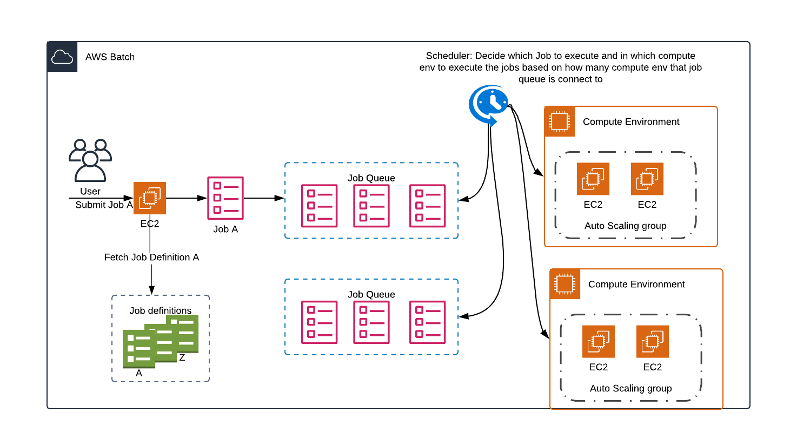
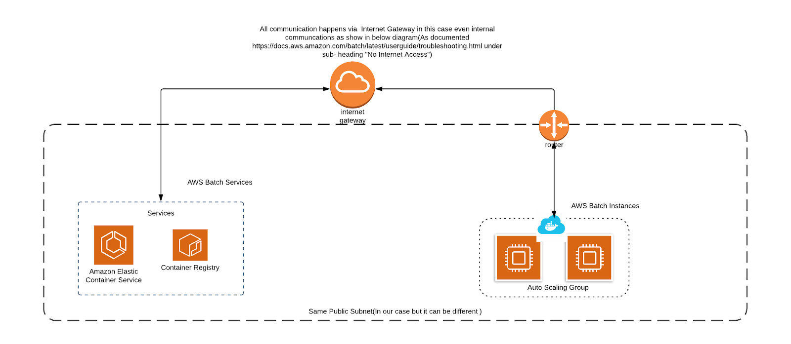

# openfoam-docker-awsbatch

## Overview
Indeelabs documentation of running OpenFoam job on AWS Batch.

AWS Batch allow developers to build efficient, long-running compute jobs by focusing on the business logic required (CFD simulation in this case), while AWS manages the scheduling and provisioning of the work.

### Prerequisites:
- Have an AWS account 
- Create an IAM user with administrator permissions. 
- Install and configure AWS CLI.
- If something from the above doesn’t work, it might be because a permission is missing, or the CLI is not configured properly.

## Description
by using these scripts and commands, you can run OpenFoam job on AWS Batch.
- building up base infrastructure and Docker build server for AWS Batch by CloudFormation
- after the base infrastructure become ready, build docker image and push it to AWS ECR.
- create job definition, compute environment and job queue for AWS Batch
- submit jobs to AWS Batch
- part of result data will be upload to S3 bucket which is created by CloudFormation

# Usage
1. login to aws console with admin
2. go to EC2
3. create a KeyPair
4. run CloudFormation for AWS Batch base infrastructure
5. login to ubuntu server
6. run ubuntu setup script
7. build Docker images with the Dockerfile
8. push the images to AWS ECR
9. edit json files based on created AWS resources
10. create job definition (w/ multi-nodes) on AWS Batch
11. create computing environment on AWS Batch
12. create job queue on AWS Batch
13. submit jobs


# Step 1: Create Nextflow

Nextflow streamlines the use of AWS Batch by smoothly integrating it in its workflow processing model and enabling transparent interoperability with other systems.

Use CloudFormation to create the following:
1) The core set of resources (S3 Bucket, IAM Roles, AWS Batch) described in the Getting Started section.
2) A containerized nextflow executable that pulls configuration and workflow definitions from S3
3) The AWS CLI installed in job instances using conda
4) A Batch Job Definition that runs a Nextflow head node
5) An IAM Role for the Nextflow head node job that allows it access to AWS Batch
6) An S3 Bucket to store your Nextflow workflow definitions


# Step 2: Create OpenFOAM Docker Image

This step shows how to create development environment to containizing CFD application <br/>
(A development environment is a place in AWS Cloud9 where you store your project's files and where you run the tools to develop your applications.)

## Step 2a: Create AWS Cloud9 Environment

create new environment named "peter-dev-machine"

## Step 2b: Create Docker


Docker is set of tools that make running, building and managing software containers much easier than it otherwise might be.

First user need to connect an AWS Cloud9 SSH development environment to a running Docker container inside of an Amazon Linux instance in Amazon EC2

Use this docker file for packing up openfoam installation <br/>
https://github.com/peter-indeelabs/AWS-openfoam/blob/master/Dockerfile

Here are the docker commands: <br/>
https://github.com/peter-indeelabs/AWS-openfoam/blob/master/docker%20commands

(Reference: https://github.com/peter-indeelabs/AWS-openfoam/blob/master/aws-scripts.sh)

# Step 3: Creating an ECR repository
The next step is to create an ECR repository to store the Docker image created from previous step, so that it can be retrieved by AWS Batch when running jobs.

Create "nextflow" repository

Now that we have a Docker image and an ECR repository, it is time to push the image to the repository. Use the following AWS CLI commands with Indee account run in cloud9 terminal:

```
cd openfoam-cfd/containers
$(aws ecr get-login --no-include-email --region us-west-2)
docker build -t nextflow .
docker tag nextflow:latest 933794880782.dkr.ecr.us-west-2.amazonaws.com/nextflow:latest
docker push 933794880782.dkr.ecr.us-west-2.amazonaws.com/nextflow:latest
```

NOTE: Please make sure ECR repository is enabled.


# Step 4: Create AWS Batch

## Step 4a: Create bucket 
To allow files to be uploaded to Amazon S3, it is required to create S3 bucket in West-2 region. Create the following buckets on S3. <br/>
- indeesfxsync 
- indeefdata 
- indeednfsworkdir 
 
In the bucket policy, make sure add the following policy:
```
{
    "Version": "2012-10-17",
    "Statement": [
        {
            "Effect": "Allow",
            "Principal": "*",
            "Action": [
                "s3:PutObject",
                "s3:PutObjectAcl"
            ],
            "Resource": "arn:aws:s3:::indeenfsworkdir/sim18-run-batch/output/*"
        }
    ]
}
```

In the CORS configuration, make sure add the following xml code:
```
<?xml version="1.0" encoding="UTF-8"?>
<CORSConfiguration xmlns="http://s3.amazonaws.com/doc/2006-03-01/">
<CORSRule>
    <AllowedOrigin>yourdomain.com</AllowedOrigin>
    <AllowedMethod>GET</AllowedMethod>
    <AllowedMethod>POST</AllowedMethod>
    <AllowedMethod>PUT</AllowedMethod>
    <AllowedHeader>*</AllowedHeader>
</CORSRule>
</CORSConfiguration>
```

## Step 4b: Create Launch Template
A launch template can contain all or some of the parameters to launch an instance. When you launch an instance using a launch template, you can override parameters that are specified in the launch template.

Make sure set volume storage to 1000GB and enable "Delete on termination" 

## Step 4c: Create/Build batch job



AWS Batch is a managed computing service that allows the execution of containerised workloads over the Amazon EC2 Container Service (ECS).

Batch is organised in Compute Environments, Job queues, Job definitions and Jobs.
AWS Batch organises its work into four components:
1. Compute Environment: The compute resources that run your Jobs. <br/>
The Compute Environment allows you to define the computing resources required for a specific workload (type). You can specify the minimum and maximum number of CPUs that can be allocated, the EC2 provisioning model (On-demand or Spot), the AMI to be used and the allowed instance types. <br/>

Here are some options: <br/>
1) 96cores 190GB memory (c5.metal $4.08 per Wall-clock-Hour)

In the environment variables, please use the following keys and values
- (KEY) BATCH_FILE_S3_URL (VALUE) s3://indeenfsworkdir/test-190/potential/test.sh (need to change per run)
- (KEY) NF_WORKDIR (VALUE) /fsx/test-190  (need to change per run)
- (KEY) NF_LOGSDIRs3 (VALUE) //indeenfsworkdir/logs
- (KEY) NF_JOB_QUEUEarn (VALUE) aws:batch:us-west-2:933794880782:job-queue/default-13dd0220-f421-11e9-820f-065424fac776


Make to set maximum vCPUs=400 (to allow 2 jobs running at the same time)

2. Job Queues: All submitted jobs are listed in the job queues. <br/>
The Job queue definition allows you to bind a specific task to one or more Compute Environments. <br/>
Please use the following queue for "on-demand" to avoid interruption of job: highpriority-231522c0-0184-11ea-8bbd-06343619a258

3. Job Definition: Where you describe how your work is to be executed. <br/>
The Job definition is a template for one or more jobs in your workload. This is required to specify the Docker image to be used in running a particular task along with other requirements such as the container mount points, the number of CPUs, the amount of memory and the number of retries in case of job failure. <br/>
Pleae use the following job definition: nextflow Rev5 (multinode)

Make sure choose multi-node option and set the following parameters: <br/>
Number of nodes:2

4. Jobs: The unit of work submitted to AWS Batch, whether it be implemented as a shell script, executable or Docker container image. <br/>
The Job binds a Job definition to a specific Job queue and allows you to specify the actual task command to be executed in the container. 

Use the following to run 190cpu job (must lower memory to 120000MB otherwise job retains in RUNNABLE): <br/>
Command=test.sh <br/>
vCPU=95 <br/>
memory: 120000MB <br/>

Internally AWS Batch uses many services i.e.
- EC2 Instances
- Elastic Container Service (ECS)
- Elastic Container Registry (ECR) <br/>
which are shown in the following diagram and internet access is required for some communications



# Step 5: Create AWS System Session Manager

Session Manager is a fully managed AWS Systems Manager capability that lets you manage your Amazon EC2 instances through an interactive one-click browser-based shell or through the AWS CLI. 

This is set-up so user can tail log files from CFD output files and monitor the runs (Do not submit job manually from session manager).

The following commands are useful:

- List containers <br/>
```
sudo docker ps
```

- Run docker exec on a running container <br/>
```
sudo docker exec -it xxx /bin/bash
```
# Step 6: Create Remote GPU Machine for post-processing

### Step 6a: Set-up GPU instance on EC2
g3.4xlarge	16cores $1.14 per Hour

### Step 6a: Download and Install Remmina on local machine
- sudo apt update
- sudo apt install remmina

### Step 6b: Decript windows password
- Select the instance, choose Actions, and then choose Get Windows Password

### Step 6c: Set-up configuratoin
- User: Administrator
- Password: (from Step 6b)
- Server: (use EC2 instance IPv4 Public IP)

### Step 6d: Download and Install Paraview tools (4.3.1)
1) Install python
2) Install pip
3) Install awscli

### Step 6e: Expand EBS disk space
Open the remote desktop protocol (RDP) session for the instance, launch the Disk Management view by using the diskmgmt.msc command, choose Action, and then choose Refresh.

- Open the context (right-click) menu, and then choose Extend Volume.

# User Notes:
PotentialFoam:
- copy polyMesh/ folder (new geometry mesh) to constant/ folder (~4-5GB)
- download 0/ folder to local machine from potentialfoam to edit the inlet/outlet condition in P (1-2 GB) and U files after complete potentialfoam solution

# References: 
1) Docker CLI References https://docs.docker.com/engine/reference/commandline/docker/
